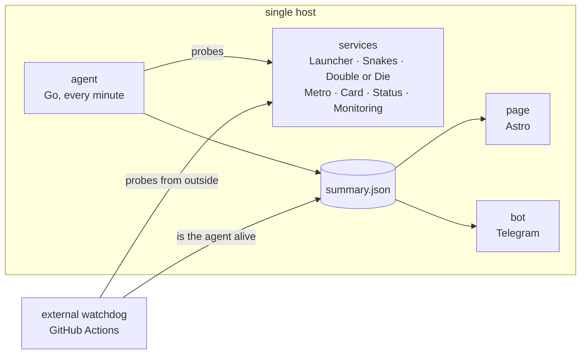

# status.samoy.love

[Русский](README.md) · English

[](https://github.com/tr0llex/status.samoy.love/actions/workflows/ci.yml)
[](https://codecov.io/gh/tr0llex/status.samoy.love)
[](https://status.samoy.love)
[](LICENSE)

The status page for the [samoy.love](https://samoy.love) services — live at
**[status.samoy.love](https://status.samoy.love)**: uptime, versions and
incidents for visitors who need to know whether the service is down or their
own connection is.

Five projects share one host, and sooner or later everyone asks "it does not
open for me — is that you or me?". Answering that by hand, after the fact, is a
poor plan, so the answer is computed continuously: an agent walks the services
every minute, an external watchdog does the same from the outside, and a
Telegram bot wakes the owner before a user does.


## How it works



**The watchdog lives in GitHub Actions rather than on the server, and that is
the central decision of this repository.** An agent on a downed host cannot
report that the host is down: the services take the page, the bot and the probe
loop with them. So the same endpoints are walked in parallel by the `probe`
workflow (`scripts/probe.mjs`). Its history is committed to a separate
[`status-data`](https://github.com/tr0llex/status.samoy.love/tree/status-data)
branch: a commit per pass would bury the actual code changes in `main`.

**The frequency of that walk is not promised, it is displayed.** The schedule
asks for a run every five minutes — the finest cron interval GitHub offers —
but that is a request, not an obligation: under load runs get dropped, and the
real gap over a day ranged from one hour to three and a half. So instead of a
frequency the age is computed: the run summary and the data commit message say
how long the watchdog was away, and a gap longer than six hours goes to
Telegram as its own message.

**The agent (`agent/`, Go) lives on the host itself, because otherwise the
important part is invisible.** Systemd unit states, deployed versions and
release dates can only be seen from inside; the agent runs as a oneshot on a
one-minute timer, accumulates history and writes a ready-made `summary.json`
next to the page. There is no long-lived process — hence no HTTP endpoint
either, and metrics are exported as a file for the node_exporter textfile
collector: between runs nobody is left to listen on a port, but a file survives
the pause.

**The bot (`bot/`, Go) runs no checks of its own — it reads the same
`summary.json`.** Two independent probe loops would drift apart, and deciding
which one to believe would fall to a human. The voice is split between the bot
and the watchdog explicitly: while the data stays fresh the bot reports outages
(it is restarted by systemd and knows more — units, versions, reminders about
an ongoing outage), and the moment the agent goes silent the watchdog speaks.
The dead-man switch deliberately exists in both: the bot sees a stale file
locally (a five-minute threshold), the watchdog sees the absence of fresh data
from outside (ten minutes). The watchdog's threshold describes the age of the
data, not the speed of the reaction: it notices nothing before its own run, and
its runs happen whenever GitHub gets around to them.

**HTTP 200 proves nothing on its own.** A service answers 200 with a "database
unavailable" page, with an empty body, after eight seconds, or with a redirect
to an unrelated host that also answered 200. So a check is described more
broadly (`config/status.json`, 16 checks across seven projects): a marker in the
body, `Content-Type`, a latency threshold, the final host after redirects, a
criticality flag and the user-facing consequence of the failure. A project's
verdict is computed from critical checks only — an internal admin API going
down should not sound like the game server without which no matches run. A
failure is accepted only after a repeated request: it is not only the service
that flickers, but also the road to it.

**Uptime is computed over a calendar window, not over the number of accumulated
buckets.** A bucket appears only when the agent ran, so taking the last ninety
buckets for "90 days" quietly stretched the window to ninety-seven days — and
agent downtime even improved the number, because it contained no failed probes.
Days without measurements now stay as gaps, both on the bar and in the
arithmetic. For the same reason the page shows a separate grey "data is stale"
state when `updated` is older than five minutes: a frozen agent must not look
like "everything works".


The bot answers the owner only and ignores everyone else in silence — any reply
to a stranger confirms that the bot is alive and listening. Screens are
switched by editing the same message rather than sending a new one, otherwise a
week of use turns the chat into a feed of fifty near-identical cards. The
"Open" button shows a separate compact build of the page inside Telegram
(`src/pages/tg.astro`), while the logic of what the data means is shared with
the full page (`src/lib/status.ts`) — the verdicts in a browser and in a
messenger must not drift apart.


**What exactly shipped in a release is not something the bot works out itself.**
Neither it nor the agent can: there is not a single one of the deployed
repositories on the server, so there is nobody to ask `git log`. The list
therefore arrives as data — the deploy writes it into `version.json` next to the
version, the agent carries it into `summary.json` and into the deployment
journal `releases.json`, and the bot shows it twice: as an "Изменения" block in
the release notification, and later on the `/changelog` screen, once that
message has scrolled away. `/changelog` without an argument shows the latest
deploy of every target in the estate, `/changelog metro` the history of one
target, up to five deploys in a row; the same is available from the "Что
менялось" button under the versions screen.

The list is **not truncated at any link of the chain**: not by the generator on
its way into `version.json`, not by the agent, not by the bot. The
"…и ещё 1 коммит" tail cost a line and did not say which commit it was; a long
answer meets Telegram's limit by being split across several consecutive
messages, not by being shortened. A PR number from the subject arrives as a link
to the PR itself — the only markup allowed through the agent, and even that is
rebuilt from validated pieces.

The price is that commit subjects become public: both a service's
`version.json` and the `data/*.json` files are served over HTTP to everyone —
which, for public repositories, is exactly what the git history shows anyway.
The whole path is described in [`docs/RELEASES.md`](docs/RELEASES.md) (Russian).

## Stack

`Go 1.25` · `Astro 7` · `TypeScript` · `Node` · `GitHub Actions` · `systemd` ·
`Prometheus (textfile)` · `Playwright` · `nginx`

## Quick start

Node 24 and Go 1.25.

```bash
npm install
npm run dev                                              # the page

cd agent && go run . -config ../config/status.json -data ../tmp-data

# The bot needs a token, a chat id and data the agent has already collected.
cd bot && TELEGRAM_BOT_TOKEN=… TELEGRAM_CHAT_ID=… \
  go run . -data ../tmp-data -state ../tmp-data/bot-state.json

node scripts/probe.mjs                                   # external watchdog
npm run e2e                                              # end-to-end tests
```

## Structure

| Path                    | Purpose                                                                        |
| ----------------------- | ------------------------------------------------------------------------------ |
| `agent/`                | agent: probes, systemd, versions, history, metrics                             |
| `bot/`                  | Telegram bot: commands, buttons, notifications, dead-man switch                |
| `scripts/probe.mjs`     | external watchdog, run from GitHub Actions                                     |
| `config/status.json`    | the single check config, read by agent and watchdog                            |
| `src/pages/index.astro` | the status page                                                                |
| `src/pages/tg.astro`    | compact build for the Telegram mini app                                        |
| `src/lib/status.ts`     | verdict logic shared by both builds of the page                                |
| `e2e/`                  | Playwright scenarios and the `fixtures/` data sets                             |
| `deploy/systemd/`       | units and the agent timer                                                      |
| `docs/CONFIG.md`        | how a check is described and what is configured now (Russian)                  |
| `docs/DEPLOY.md`        | deployment, provisioning, running locally (Russian)                            |
| `docs/RELEASES.md`      | the release changelog: who builds it, where it lives, how to read it (Russian) |
| `.deploy-kit/*.env`     | three deployment targets: page, agent, bot                                     |

## Tests

271 Go tests: 98 for the agent (verdicts, outage scale, failure confirmation,
systemd parsing, uptime windows, the deployment journal, metrics) and 173 for the
bot (formatting, keyboards, the changelog screen, dead-man switch, Telegram
delivery). They run with `-race` — both
services are concurrent, and a race shows up in production at the least
convenient moment. Coverage goes to Codecov under two flags.

8 Playwright scenarios against a real build of the page. The data is swapped
for sets from `e2e/fixtures/` — waiting for production to break in order to
learn whether the page survives it is a poor plan. The clock is frozen in the
tests: the page prints relative time, and without that a test would be green
today and red tomorrow on its own. 4 more scenarios (`npm run e2e:prod`) run
against the live site by hand and catch a silently dead agent: data older than
an hour is a red run.

Every end-to-end test carries the same guard: any browser console error and any
failed network request fails it. A status page returns 200 even when its script
died on an unexpected field and the screen is blank.

CI gates a pull request on `go vet`, golangci-lint and `-race` tests for both
services, ESLint, the format check, types and templates, the page build, a
parse of `config/status.json` (read by both the agent and the watchdog — a
syntax error there breaks both at once) and the full end-to-end run. A red gate
means no release.

## Deployment

Three independent targets: the page, the agent and the bot. Editing the page
does not restart data collection, and updating the agent does not wait for a
static rebuild. A push to `main` rolls out only what changed: a needless
deployment restarts a unit and resets its uptime for nothing.

```bash
dk                          # what is on prod right now
dk deploy status-site       # the page
dk deploy status-agent      # the agent
dk deploy samoylove-bot     # the bot
dk rollback status-agent    # roll back
```

The mechanism itself lives in [deploy-kit](https://github.com/tr0llex/deploy-kit),
nginx configuration included. This repository has no deployment scripts of its
own.

## Part of samoy.love

Not a pile of side projects but one system: one domain, one server, one release
pipeline, one status page, one monitoring stack.

| Project                                                             | What it is                                                | Code                                                                |
| ------------------------------------------------------------------- | --------------------------------------------------------- | ------------------------------------------------------------------- |
| [samoy.love](https://samoy.love)                                    | personal homepage and showcase                            | [samoy.love](https://github.com/tr0llex/samoy.love)                 |
| [launcher.samoy.love](https://launcher.samoy.love)                  | ChillHub — a Windows game launcher with diff updates      | [chillhub](https://github.com/tr0llex/chillhub)                     |
| [snakes.samoy.love](https://snakes.samoy.love)                      | multiplayer territory capture, binary WebSocket protocol  | [snakes](https://github.com/tr0llex/snakes)                         |
| [metro.samoy.love](https://metro.samoy.love)                        | offline PWA of the Moscow metro map                       | [metro-map](https://github.com/tr0llex/metro-map)                   |
| [status.samoy.love](https://status.samoy.love)                      | service status: uptime, versions, incidents               | [status.samoy.love](https://github.com/tr0llex/status.samoy.love)   |
| [metrics.samoy.love](https://github.com/tr0llex/metrics.samoy.love) | monitoring and traffic stats without third-party trackers | [metrics.samoy.love](https://github.com/tr0llex/metrics.samoy.love) |
| —                                                                   | the shared release pipeline                               | [deploy-kit](https://github.com/tr0llex/deploy-kit)                 |

The split with the monitoring next door is simple: the status page looks
outward, for visitors; monitoring looks inward, for the owner. The agent here
hands its metrics over through the node_exporter textfile collector.

## Contacts and licence

[alex@samoy.love](mailto:alex@samoy.love) · [t.me/tr0llex](https://t.me/tr0llex) ·
[github.com/tr0llex](https://github.com/tr0llex)

This is personal infrastructure and the repository is meant for reading: pull
requests are not expected, questions are welcome.

[MIT](LICENSE) © 2026 Alexey Samoylov
