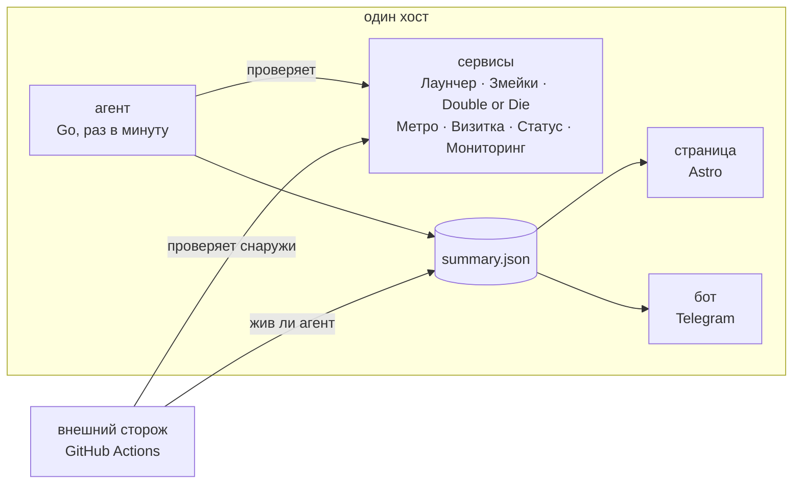

# status.samoy.love

Русский · [English](README.en.md)

[](https://github.com/tr0llex/status.samoy.love/actions/workflows/ci.yml)
[](https://codecov.io/gh/tr0llex/status.samoy.love)
[](https://status.samoy.love)
[](LICENSE)

Статус-страница сервисов [samoy.love](https://samoy.love) — вживую на
**[status.samoy.love](https://status.samoy.love)**: аптайм, версии и инциденты
для посетителей, которым нужно понять, лежит сервис или лежит их интернет.

Пять проектов на одном хосте, и вопрос «у меня не открывается — это вы или
я?» рано или поздно задаёт каждый. Отвечать на него постфактум и вручную —
плохая идея, поэтому ответ считается сам: агент обходит сервисы раз в минуту,
внешний сторож делает то же самое снаружи, а бот в Telegram будит владельца
раньше, чем это сделает пользователь.


## Как устроено



**Сторож живёт в GitHub Actions, а не на сервере — и это главное решение
репозитория.** Агент на упавшем хосте не может сообщить, что хост упал:
вместе с сервисами исчезают и страница, и бот, и сам обход. Поэтому те же
эндпоинты параллельно обходит воркфлоу `probe` (`scripts/probe.mjs`). Историю
он коммитит в отдельную ветку
[`status-data`](https://github.com/tr0llex/status.samoy.love/tree/status-data):
коммит на каждый обход в `main` похоронил бы правки кода.

**Частота этого обхода не обещается, а показывается.** Расписание просит
запуск каждые пять минут — мельче cron у GitHub не умеет, — но это просьба, а
не обязательство: под нагрузкой запуски пропускаются, и реальный интервал за
сутки гулял от часа до трёх с половиной. Поэтому вместо частоты считается
возраст: сводка и сообщение коммита говорят, сколько сторожа не было, а
перерыв длиннее шести часов уходит в Telegram отдельным сообщением.

**Агент (`agent/`, Go) живёт на самом хосте, потому что иначе не увидеть
главного.** Systemd-юниты, выкаченные версии и даты релизов видны только
изнутри; агент запускается таймером раз в минуту как oneshot, копит историю и
складывает готовый `summary.json` рядом со страницей. Постоянного процесса
нет — HTTP-эндпоинта у него тоже нет, и метрики он выгружает файлом для
textfile-коллектора node_exporter: между запусками слушать порт некому, а файл
паузу переживает.

**Бот (`bot/`, Go) своих проверок не делает — он читает тот же
`summary.json`.** Два независимых обхода расходились бы во времени, и решать,
кому верить, пришлось бы человеку. Голос между ботом и сторожем разделён явно:
пока данные свежие, о падениях пишет бот (он перезапускается systemd и знает
больше — юниты, версии, напоминания о длящемся простое), а как только агент
замолчал, говорит сторож. Дед-мэн намеренно есть у обоих: бот видит несвежий
файл локально (порог 5 минут), сторож — отсутствие свежих данных снаружи
(10 минут). Порог сторожа описывает возраст данных, а не скорость реакции:
раньше собственного запуска он ничего не заметит, а запускают его когда
придётся.

**Код 200 сам по себе ничего не доказывает.** Сервис отвечает 200 страницей
«база данных недоступна», пустым телом, за восемь секунд или редиректом на
посторонний хост, который тоже ответил 200. Поэтому проверка описывается шире
(`config/status.json`, 16 проверок на семь проектов): маркер в теле,
`Content-Type`, порог времени, конечный хост после редиректов, признак
критичности и текст последствия для пользователя. Вердикт проекта считается
только по критичным проверкам — падение внутренней админки не должно звучать
как падение игрового сервера, без которого не идут матчи. Сбой признаётся
после повторного запроса: моргает не только сервис, но и дорога до него.

**Аптайм считается по календарному окну, а не по числу накопленных корзин.**
Корзина заводится, только когда агент отработал, поэтому «за 90 дней» из
последних девяноста корзин незаметно растягивало окно на девяносто семь суток,
а простой агента ещё и улучшал цифру — плохих замеров в нём не было. Сутки без
замеров остаются дырками и на шкале, и в счёте. По той же причине страница
показывает отдельное серое «данные устарели», если `updated` старше пяти
минут: замерший агент не должен выглядеть как «всё работает».


Бот отвечает только владельцу, чужие сообщения игнорирует молча — любой ответ
незнакомцу подтверждает, что бот жив и слушает. Экраны переключаются правкой
того же сообщения, а не новым: иначе за неделю чат превращается в ленту из
полусотни почти одинаковых карточек. Кнопка «Открыть» показывает отдельную
компактную версию страницы внутри Telegram (`src/pages/tg.astro`), а логика
«что означают эти данные» общая с большой страницей (`src/lib/status.ts`) —
разъезжаться вердикты в браузере и в мессенджере не должны.


**Что именно уехало в релизе, бот знает не сам.** Составить список изменений
ни он, ни агент не могут: на сервере нет ни одного из выкаченных репозиториев,
и спросить `git log` не у кого. Поэтому список приезжает данными — выкатка
кладёт его в `version.json` рядом с версией, агент переносит в `summary.json` и
в журнал выкаток `releases.json`, а бот показывает дважды: блоком «Изменения» в
уведомлении о релизе и экраном `/changelog` потом, когда сообщение уже ушло
вверх ленты. `/changelog` без аргумента — последняя выкатка каждой цели
хозяйства, `/changelog metro` — история одной цели, до пяти выкаток подряд; то
же самое есть кнопкой «Что менялось» под экраном версий.

Список **не режется ни в одном звене**: ни генератором по дороге в
`version.json`, ни агентом, ни ботом. Хвост «…и ещё 1 коммит» стоил строки и не
говорил, какой это коммит; в лимит Telegram длинный ответ укладывается
разбиением на несколько сообщений подряд, а не сокращением. Номер PR из темы
приезжает ссылкой на сам PR — единственная разметка, которой позволено проехать
через агента, и та собирается заново из проверенных кусков.

Ценой этого темы коммитов становятся публичными: и `version.json` сервиса, и
`data/*.json` раздаются по HTTP всем — для открытых репозиториев это ровно то,
что и так видно в истории git. Путь целиком описан в
[`docs/RELEASES.md`](docs/RELEASES.md).

## Стек

`Go 1.25` · `Astro 7` · `TypeScript` · `Node` · `GitHub Actions` · `systemd` ·
`Prometheus (textfile)` · `Playwright` · `nginx`

## Быстрый старт

Node 24 и Go 1.25.

```bash
npm install
npm run dev                                              # страница

cd agent && go run . -config ../config/status.json -data ../tmp-data

# Боту нужны токен, chat id и уже собранные агентом данные.
cd bot && TELEGRAM_BOT_TOKEN=… TELEGRAM_CHAT_ID=… \
  go run . -data ../tmp-data -state ../tmp-data/bot-state.json

node scripts/probe.mjs                                   # внешний сторож
npm run e2e                                              # сквозные тесты
```

## Структура

| Путь                    | Назначение                                                     |
| ----------------------- | -------------------------------------------------------------- |
| `agent/`                | агент: обход проверок, systemd, версии, история, метрики       |
| `bot/`                  | телеграм-бот: команды, кнопки, уведомления, дед-мэн            |
| `scripts/probe.mjs`     | внешний сторож, запускается из GitHub Actions                  |
| `config/status.json`    | единый конфиг проверок для агента и сторожа                    |
| `src/pages/index.astro` | страница статуса                                               |
| `src/pages/tg.astro`    | компактная версия для мини-приложения Telegram                 |
| `src/lib/status.ts`     | общая логика вердиктов для обеих версий страницы               |
| `e2e/`                  | сценарии Playwright и наборы данных `fixtures/`                |
| `deploy/systemd/`       | юниты и таймер агента и бота                                   |
| `docs/CONFIG.md`        | как описывается проверка и что настроено сейчас                |
| `docs/DEPLOY.md`        | выкатка, первичная настройка, локальный запуск                 |
| `docs/RELEASES.md`      | список изменений релиза: кто собирает, где лежит, как смотреть |
| `.deploy-kit/*.env`     | три цели выкатки: страница, агент, бот                         |

## Тесты

271 Go-тестов: 98 у агента (вердикты, масштаб сбоя, подтверждение сбоя,
разбор systemd, окна аптайма, журнал выкаток, метрики) и 173 у бота
(форматирование, кнопки, экран изменений, дед-мэн, отправка в Telegram).
Прогон идёт с `-race` — и агент, и бот работают
конкурентно, а гонка проявляется на проде в самый неудобный момент. Покрытие
уезжает в Codecov двумя флагами.

8 сценариев Playwright по настоящей сборке страницы. Данные подменяются
наборами из `e2e/fixtures/` — ждать, пока прод сам сломается, чтобы узнать,
переживёт ли это страница, плохой план. Часы в тестах зафиксированы: страница
печатает относительное время, иначе тест зеленел бы сегодня и краснел завтра
сам по себе. Ещё 4 сценария (`npm run e2e:prod`) идут по живому сайту руками
и ловят молча умерший агент: данные старше часа — красный прогон.

Во всех сквозных тестах работает один и тот же страж: любая ошибка в консоли
браузера и любой неудачный сетевой запрос валят тест. Статус-страница отдаёт
200 и когда скрипт упал на неожиданном поле, а на экране пусто.

CI гейтит пулл-реквест: `go vet`, golangci-lint и тесты с `-race` для обоих
сервисов, ESLint, проверка формата, типы и шаблоны, сборка страницы, разбор
`config/status.json` (его читают и агент, и сторож — синтаксическая ошибка
ломает обоих разом) и полный сквозной прогон. Красный гейт — выкатки нет.

## Выкатка

Три независимые цели: страница, агент и бот. Правка страницы не перезапускает
сбор данных, обновление агента не ждёт пересборки статики. Пуш в `main` катит
только то, что менялось: лишняя выкатка перезапускает службу и обнуляет аптайм
на ровном месте.

```bash
dk                          # что сейчас на проде
dk deploy status-site       # страница
dk deploy status-agent      # агент
dk deploy samoylove-bot     # бот
dk rollback status-agent    # откатить
```

Сама механика живёт в [deploy-kit](https://github.com/tr0llex/deploy-kit),
там же конфигурация nginx. Своих скриптов деплоя в этом репозитории нет.

## Часть samoy.love

Не россыпь пет-проектов, а одна система: один домен, один сервер, один
релизный пайплайн, одна статус-страница, один мониторинг.

| Проект                                                              | Что это                                                       | Код                                                                 |
| ------------------------------------------------------------------- | ------------------------------------------------------------- | ------------------------------------------------------------------- |
| [samoy.love](https://samoy.love)                                    | личная страница и витрина                                     | [samoy.love](https://github.com/tr0llex/samoy.love)                 |
| [launcher.samoy.love](https://launcher.samoy.love)                  | ChillHub — лаунчер игр для Windows с обновлениями по диффу    | [chillhub](https://github.com/tr0llex/chillhub)                     |
| [snakes.samoy.love](https://snakes.samoy.love)                      | мультиплеерный захват территории, бинарный WebSocket-протокол | [snakes](https://github.com/tr0llex/snakes)                         |
| [metro.samoy.love](https://metro.samoy.love)                        | офлайн-PWA со схемой московского метро                        | [metro-map](https://github.com/tr0llex/metro-map)                   |
| [status.samoy.love](https://status.samoy.love)                      | состояние сервисов: аптайм, версии, инциденты                 | [status.samoy.love](https://github.com/tr0llex/status.samoy.love)   |
| [metrics.samoy.love](https://github.com/tr0llex/metrics.samoy.love) | мониторинг и посещаемость без трекеров                        | [metrics.samoy.love](https://github.com/tr0llex/metrics.samoy.love) |
| —                                                                   | общий релизный пайплайн                                       | [deploy-kit](https://github.com/tr0llex/deploy-kit)                 |

Разделение с соседним мониторингом простое: статус-страница смотрит наружу,
для посетителей; мониторинг — внутрь, для владельца. Агент отсюда отдаёт туда
метрики через textfile-коллектор node_exporter.

## Контакты и лицензия

[alex@samoy.love](mailto:alex@samoy.love) · [t.me/tr0llex](https://t.me/tr0llex) ·
[github.com/tr0llex](https://github.com/tr0llex)

Это личная инфраструктура, и репозиторий читательский: PR не ожидаются,
вопросы — пожалуйста.

[MIT](LICENSE) © 2026 Алексей Самойлов
