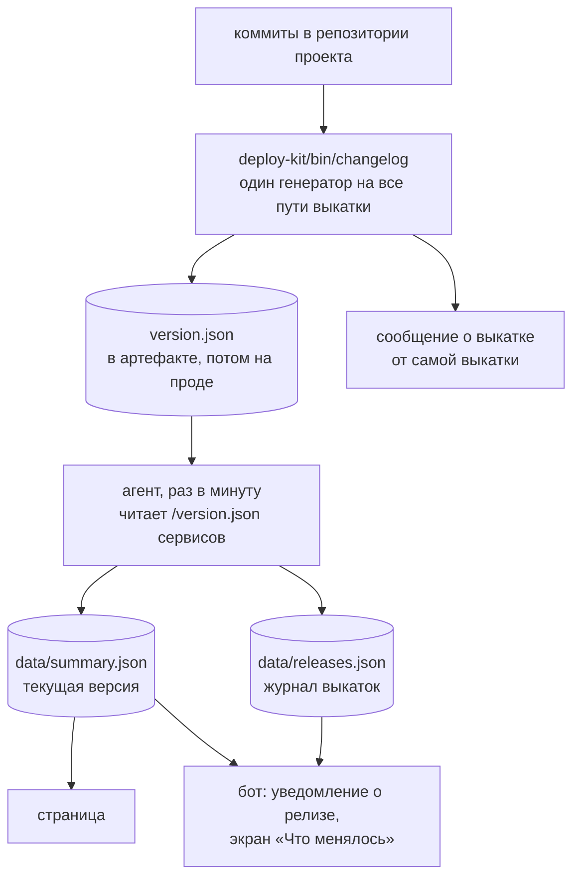

# Список изменений: от коммита до чата

Откуда берётся блок «Изменения» под сообщением о релизе и что показывает
`/changelog`. Путь длинный и проходит через два репозитория, поэтому описан
целиком в одном месте: половина его живёт в
[deploy-kit](https://github.com/samoy-love/deploy-kit), половина здесь, и чинить
это, читая по половине, невозможно.

Короткая версия: **список составляет выкатка, а не агент и не бот.** Ни агент,
ни бот составить его не могут — они живут на сервере, где нет ни одного из
выкаченных репозиториев, и спросить `git log` им попросту не у кого. Поэтому
список приезжает к ним данными, файлом, вместе с релизом.

## Путь целиком



Путей до чата два, и это не дублирование. Сообщение от выкатки приходит в
момент выкатки и говорит «я это сделала»; уведомление бота приходит, когда
новая версия **замечена работающей на проде**, и говорит «оно действительно
поехало». Разница между ними — ровно тот случай, ради которого статус-страница
и заведена: зелёная выкатка со старыми файлами.

## 1. Как список собирается

Собирает `deploy-kit/bin/changelog` — один скрипт на все три пути выкатки
(`bin/deploy`, `go-service.yml`, `static-site.yml`). Подробности и все
аргументы — в [README deploy-kit](https://github.com/samoy-love/deploy-kit#список-изменений);
здесь важно следующее.

**Диапазон** выбирается сверху вниз, первый сработавший выигрывает: явно
переданная предыдущая ревизия (в CI это `github.event.before`), затем последний
тег, достижимый из `HEAD` (а если тег стоит ровно на `HEAD` — предыдущий),
затем последние восемь коммитов. Третий вариант — это уже не «что изменилось с
прошлого релиза», а «что тут недавно делали», зато он есть всегда.

**Выпадает** из списка служебное: слияния, `fixup!`, `WIP`, подъёмы версии,
подъёмы зависимостей от бота. Повторяющиеся темы схлопываются. Причина
бытовая: релизы читают с телефона, и каждая такая строка вытесняет настоящую.

**Срезается** хвост `(#NN)`, который GitHub дописывает к теме при сквош-мерже.
Слияние PR в хозяйстве всегда сквошем, поэтому список релиза — это, как
правило, ровно заголовки PR; голым текстом номер место занимает, а никуда не
ведёт. Срезается только хвост и только в виде `(#цифры)` — «поправить кодировку
(см. #42)» остаётся как есть.

**И тут же возвращается ссылкой**, если вызывающая сторона знает адрес
репозитория (`--link-base` у генератора; выкатка выводит его из `origin`, CI —
из `github.repository`):

```html
• Завести dependabot одинаково во всех репозиториях
<a href="https://github.com/samoy-love/deploy-kit/pull/21">#21</a>
```

Читатель видит те же `#21`, но по ним можно уйти в обсуждение. Адрес — всегда
`<база>/pull/<номер>`: GitHub переадресует `/pull/N` в `/issues/N` и обратно,
так что ссылка верна и когда номер оказался номером issue. Базы нет — номер
просто срезается, как раньше; это обычный исход, а не поломка.

**Ограничено** по умолчанию: не больше восьми пунктов, не больше 120 СИМВОЛОВ
на тему, не больше 1200 символов на блок. Но все три пути выкатки зовут
генератор **со снятыми пределами** — и в чат, и в `version.json` уезжает полный
список релиза, без хвоста. Причина в порядке: обрезаний по дороге до читателя
два, и первое решает всё. Ни бот, ни страница не могут спросить `git log`, они
читают файл, и чего в файле нет, того не покажет никто, как их ни правь.
Зовётся генератор при этом по-прежнему ровно один раз за выкатку, и оба
потребителя — файл и сообщение — читают одну и ту же строку.

Потолок при снятых пределах остаётся: 200 пунктов и 20000 символов.
`version.json` раздаётся по HTTP и опрашивается раз в минуту, и патологический
вход тут не «сотня коммитов», а `--since` на первый коммит репозитория — без
потолка туда молча уехала бы вся история, и на каждой выкатке. Потолок —
единственное, что при снятых пределах ещё может обрезать список, и ровно
поэтому он честно объявляет об этом хвостом.

120 символов на тему остаются: это потолок, записанный владельцем в CLAUDE.md,
и режет его ровно один участник цепочки. Ни агент, ни бот не строже генератора.

Счёт в символах, а не в байтах: 120 символов — это потолок темы, записанный
владельцем в CLAUDE.md, а байт брал бы за русскую букву двойную плату и означал
бы для кириллицы половину нормы. Лимит Telegram (4096) считается в единицах
UTF-16, которых у кириллицы столько же, сколько символов; разметка ссылок в них
входит полностью, а видимая длина, по которой считаются `--width` и `--budget`,
— нет.

Хвост `…и ещё N коммитов` теперь значит ровно «список обрезан пределом» — и
ничего больше. Раньше он считал все коммиты диапазона вместе с шумом и
повторами, поэтому появлялся и там, где не обрезалось ничего: релиз из двух
черри-пиков одного изменения давал «…и ещё 1 коммит» — про коммит, скрытый
намеренно. Строка занимала место и не говорила, какой это коммит; ровно на неё
владелец и пожаловался.

Пустой вывод — нормальный исход, а не ошибка: нет истории, всё отфильтровано,
не тот каталог, нет `git` — везде пусто, код возврата 0 и одна строка с
причиной в stderr.

## 2. Где он хранится

Три файла, три разных срока жизни.

| Файл                   | Что в нём                                                                 | Сколько живёт                             |
| ---------------------- | ------------------------------------------------------------------------- | ----------------------------------------- |
| `version.json` сервиса | ПОЛНЫЙ список текущей версии, дословный вывод генератора одной строкой    | до следующей выкатки                      |
| `data/summary.json`    | список текущей версии каждой цели, уже разобранный на пункты              | переписывается раз в минуту               |
| `data/releases.json`   | журнал выкаток: версия, время сборки, время обнаружения, список изменений | 20 записей на цель, текст — у пяти свежих |

### version.json

Выкатка добавляет **один необязательный ключ** рядом с полями, которые там
были всегда:

```json
{
    "version": "release-20260803-120000-1a2b3c4",
    "commit": "1a2b3c4",
    "builtAt": "2026-08-03T12:00:00+03:00",
    "changelog": "<b>Изменения</b>\n• исправить падение на пустом конфиге\n• обновить nginx до 1.24 <a href=\"https://github.com/samoy-love/deploy-kit/pull/21\">#21</a>"
}
```

Значение — дословный stdout генератора, вместе с заголовком и маркерами, одной
JSON-строкой. Нормализует его читатель, потому что писателей три, а читатель
один. Ключа нет вовсе, когда показывать нечего: `"changelog":""` означало бы
«изменений не было», а это другое утверждение.

Разбор в агенте (`agent/main.go`, `changelogField`) терпим намеренно и
**никогда не возвращает ошибку**: принимает и массив строк, и одну строку с
переводами строк, а на числе или объекте просто оставляет поле пустым.
`version.json` нужен прежде всего ради версии — по ней выкатка себя проверяет,
— и чужая форма необязательного поля не повод потерять версию вместе со всей
проверкой.

Дальше `normalizeChangelog` приводит блок к простому тексту: снимает заголовок,
снимает маркеры `•`, разэкранирует HTML-подстановки и держит потолки — 100
пунктов, 15 000 символов на весь список, 240 символов на пункт. Хранить чужую
разметку в `summary.json` нельзя: файл читает не только бот, но и страница, и
экранирует каждый по-своему.

Пунктов было 12, и это была **первая из двух обрезок, о которых просили
забыть**: чего агент не положил в `summary.json`, боту уже не показать. Сто —
это не «сколько показываем», а «сколько вообще бывает»: медиана релиза в
хозяйстве три коммита, самый крупный за год — сорок один. Потолок на число
пунктов сам по себе ничего не ограничивает (сто пунктов по 240 символов — это
24 000 символов на каждую из девятнадцати целей, а `summary.json` тянет
страница на каждой загрузке), поэтому рядом стоит потолок на весь список.

Считается при этом **хранимая строка целиком, вместе с разметкой ссылки**: этот
предел про память и размер файла, а разметка занимает и то и другое наравне с
буквами. Читателю она невидима, и ширину пункта поэтому не ест — но это другой
предел и про другое. Число пришлось поднять, когда появились ссылки на PR:
пункт со ссылкой длиннее пункта без неё примерно на 63 символа, то есть на
треть, и прежние 9000 (посчитанные для голого текста как «сорок тем предельной
длины») со ссылками молча превратились из ~73 пунктов в ~48. Молча — худшее из
свойств: список обрывается без хвоста, и «больше ничего и не было» неотличимо
от «остальное не поместилось». 15 000 — это ~82 пункта со ссылками, вдвое
больше самого крупного релиза в истории хозяйства.

240 на пункт — это вдвое больше владельческих 120, и запас намеренный. Агент
здесь труба, а не оформитель: режет по месту бот, там же и многоточие. **Ни
агент, ни бот не строже генератора** — тема в 120 символов обязана доехать до
читателя ровно такой, какой её написали, и режет её ровно один участник
цепочки. Пока мерка была своя у каждого (100 байт у генератора, 300 у агента,
100 у бота), одна и та же тема резалась дважды на разной длине, причём второй
рез приходился уже на многоточие первого.

Общий потолок списка проверяется целым пунктом и ДО добавления, а не обрезкой
последнего: половина пункта — это половина тега ссылки, а на битую разметку
Telegram отвечает отказом, то есть уведомление не приходит вовсе. Первый пункт
проходит всегда: список из одной строки не бывает «слишком длинным», он бывает
единственным, что вообще есть сказать.

#### Ссылка на PR — единственная разметка, которой позволено проехать

Правило простое и проверяемое: **якорь в пункте `summary.json` есть только
тот, который поставил агент.** Всё остальное — текст и экранируется как текст.

Пропускается ровно один вид тега, по списку разрешённого:

| Часть                                           | От чего защищает                                                                                                            |
| ----------------------------------------------- | --------------------------------------------------------------------------------------------------------------------------- |
| якорь ПРИЗНАЁТСЯ своим только В КОНЦЕ пункта    | в середине темы генератор ссылок не ставит — значит это чужая разметка. Снимается чужой якорь при этом ГДЕ УГОДНО, см. ниже |
| `<a href="…">` без пробела перед `>`            | атрибут ровно один: ни `onclick`, ни `target`, ни `title` не пролезут                                                       |
| `https://` буквально                            | ни `javascript:`, ни `data:`, ни `http:`                                                                                    |
| алфавит адреса без `"`, `<`, `>`, `&` и пробела | из атрибута нельзя выйти, нельзя открыть второй тег, нельзя оборвать сущность                                               |
| подпись только `#цифры`, до 12 знаков           | вложенный тег содержит `<`, цифрой не является и совпадения не даст                                                         |
| адрес до 200 байт                               | поле приезжает из чужого файла, а `summary.json` лежит в памяти у каждого читателя                                          |
| перед ссылкой нет `<` и `>`                     | вторая ссылка, незакрытый тег и `<script>` перед ссылкой отсеиваются целиком                                                |
| текст пункта непустой                           | «#21» без темы читателю не говорит ничего, и генератор так не печатает                                                      |

Совпавшая ссылка **собирается заново из проверенных кусков**, а не переносится
чужой строкой: в разметку физически нечему просочиться, кроме адреса из
разрешённого алфавита и цифр номера. Адрес при сборке ещё раз экранируется —
это стоит ноль и переживает будущую правку алфавита.

**Порядок операций здесь и есть защита.** Ссылка отделяется ДО разэкранирования
и до обрезки: и то, и другое для неё яд. А снятие чужих якорей идёт ПОСЛЕ
разэкранирования и ПОСЛЕ обрезки — потому что тема коммита пишется человеком с
правом мержа, и написать в ней `<a href="…">#1</a>` текстом ему никто не
мешает. Генератор это экранирует, агент бы разэкранировал обратно — и положил в
`summary.json` уже разметкой, то есть чужой https-адрес под видом номера PR.
После обрезки, а не до, потому что обрезка отбрасывает хвост строки и способна
вывести в конец пункта то, что раньше стояло в середине. Номер при снятии
подделки сохраняется обычным текстом: он часть темы, и терять его не за что.

**Снимается якорь в любом месте строки, а не только в конце.** Сначала здесь
стоял разбор тем же выражением, что и признание своей ссылки, — а оно привязано
к концу пункта, и правило «якорь только наш» держалось лишь для хвоста. Тема
вида «Якорь `<a href="https://чужой/х">#1</a>` в середине темы» проезжала
насквозь и ложилась в `summary.json` настоящей разметкой с чужим адресом.
Читателям это не вредило (бот такую строку целиком не признаёт ссылкой и
экранирует, а страница список изменений вовсе не рисует) — но и то и другое
свойство ЧУЖОГО кода, а правило записано здесь и держаться должно здесь. Тег
снимается вместе с регистром (`<A HREF=…>` разбирается браузером так же) и
вместе с незакрытым: снимаются теги, а не то, что между ними, поэтому номер
остаётся. Другие теги (`<b>`, `<script>`) отсюда не снимаются и уезжают в файл
текстом с угловыми скобками — ровно как «go 1.22 `<--` важно», которое снимать
нельзя; разметкой они не станут, потому что и бот, и страница экранируют всё,
кроме проверенного якоря.

### data/releases.json

Журнал выкаток агент ведёт давно и по другому поводу: по записи на каждую
замеченную смену версии, ключ — `<проект>::<название цели>`. Это и есть история
релизов, к ней осталось приделать текст.

Список изменений хранится **только у пяти свежих записей каждой цели**;
остальные пятнадцать остаются как были — версия и даты стоят дёшево, текст нет.
Пять выкаток одной цели — это неделя-две обычной работы, а спрашивают «что
приехало» про недавнее.

Внутри записи пределы **те же самые, что у `summary.json`** — 100 пунктов и
15 000 символов, — и это не совпадение: `/changelog имя` обязан показать тот же
полный список, который приходил сообщением. Второй, более строгий предел
означал бы два расходящихся рассказа об одной выкатке. Прежние 10 пунктов и
1200 символов теряли уже двенадцатикоммитный релиз: в чат уходило одно, а в
истории того же релиза оставалось другое.

Поштучного предела мало — он умножается на число целей, а их в конфиге уже
девятнадцать и будет больше: 19 × 5 × 15 000 — это под три мегабайта кириллицы в
файле, который лежит в вебруте и переписывается раз в минуту. Поэтому есть ещё
и потолок на ВЕСЬ файл — 150 000 символов, около 300 КБ. Настоящих данных там
на два порядка меньше (медиана релиза — три темы по 50 символов, ≈ 20 КБ на всё
хозяйство), но предел, который держится на «столько не бывает», — не предел.
Когда потолок всё-таки достигнут, списки снимаются со СТАРЫХ записей: «что
приехало вчера» спрашивают, «что приехало в марте» — нет.

Обрезка идёт по всей истории на каждом запуске, а не только по новой записи:
файл читается с диска, его мог записать агент другой версии или чинили руками,
а предел, который держится только на записи, — не предел.

Одна тонкость про откаты: агент сравнивает только с самой свежей записью, а не
ищет по всему списку. Откат на предыдущую версию — это тоже событие выкатки, и
он попадает в журнал отдельной строкой, а не проглатывается как «уже видели».

## 3. Кто пишет version.json

| Путь                   | Кто зовёт генератор                 | Чем собирает JSON                          |
| ---------------------- | ----------------------------------- | ------------------------------------------ |
| локальная выкатка      | `deploy-kit/bin/deploy`             | посимвольный `json_escape` в самом скрипте |
| Go-сервисы в CI        | `.github/workflows/go-service.yml`  | `jq --rawfile`                             |
| статические сайты в CI | `.github/workflows/static-site.yml` | `jq --rawfile`                             |

Во всех трёх генератор зовётся **ровно один раз за выкатку**, а его вывод
читают оба потребителя — файл и сообщение в чат. Иначе не получается:
`version.json` пишется до упаковки артефакта, сообщение уходит после
переключения релиза, между ними лежит вся выкатка целиком. Второй вызов за это
время вернул бы другой список, и файл на проде рассказывал бы про одни
изменения, а чат — про другие. А сверяет эти два источника как раз бот отсюда,
так что расхождение читалось бы как «бот врёт».

Экранирование не формальность: темы коммитов пишет кто угодно с правом на пуш,
и в них есть кавычки, обратные слэши и настоящие переводы строк. Наивный
`printf` на таком вводе делает `version.json` неразбираемым целиком — вместе с
полем `version`, по которому выкатка себя проверяет. Если `jq` недоступен или
сборка файла не удалась, пишется прежний объект `{version,commit,builtAt}`:
версия обязана уехать при любом раскладе, список изменений — нет.

## 4. Как это доходит до бота

Бот своих проверок не делает и в интернет за версиями не ходит — он читает те
же файлы агента, что и страница.

`bot/watch.go` замечает смену версии в `summary.json` и складывает событие
релиза, `bot/format.go` рисует уведомление: что обновилось, до какой версии,
какая была, когда собрано, и последним блоком — «Изменения». Последним и через
пустую строку намеренно: блок самый длинный, самый необязательный и
единственный, которого может не быть, а всё, ради чего уведомление читают
(что и до какой версии), должно оставаться выше и на прежнем месте.

Разбор строк у бота свой (`changelogItems`) и повторяет агентский. Это не
дублирование по недосмотру: `summary.json` документирован как файл, который
можно собрать и мимо агента, и на таком пути сюда приезжает ровно то, что
напечатал генератор, — с `<b>Изменения</b>` первой строкой. Пока разбор был
односторонним, этот заголовок доезжал до владельца **пунктом списка**, под
настоящим заголовком, да ещё и экранированным во второй раз:

```
<b>Изменения</b>
• &lt;b&gt;Изменения&lt;/b&gt;
• обновить nginx до 1.24
```

**Пункт бот держит разобранным на текст и ссылку** (`clItem`), а не одной
строкой, и это не мелочь оформления. У двух половин правила прямо
противоположные: текст чужой и до последнего момента остаётся текстом — его
режут по ширине и экранируют на выводе; ссылку, наоборот, нельзя ни резать, ни
экранировать, зато её адрес и подпись уже проверены по списку разрешённого.
Пока они лежали в одной строке, любое из двух правил ломало другое. Правило
отбора то же, что в агенте, вплоть до выражения: агент и бот — отдельные модули
без общего пакета, а решать «ссылка это или нет» они обязаны одинаково, иначе
расхождение увидит только читатель.

Ширину при этом считает **только текст**. Ссылка занимает место в сообщении, но
не занимает его на экране: читатель видит `#21`, а не адрес. Резать тему из-за
длины невидимого адреса значило бы наказывать её за него.

**По числу пунктов бот больше не режет.** Раньше здесь стоял свой потолок в
восемь пунктов, и всё сверх него сворачивалось в «…и ещё 1 коммит» — строку,
которая стоит строки и не говорит, какой это был коммит. Настоящее ограничение
одно — 4096 единиц UTF-16 на сообщение, — и ответ на него не «показать меньше»,
а разложить по нескольким сообщениям. Свой предел в 40 000 символов бот держит
по-прежнему, но это защита от вранья в чужом файле, а не оформление: настоящий
потолок ставит агент (100 пунктов, 15 000 символов), и числа у бота выше нарочно,
чтобы он не оказался тем, кто урезал уже разрешённое.

### Версия ведёт на коммит

Строка версии `release-<дата>-<sha>` называет коммит, но не вела к нему: чтобы
увидеть, что именно уехало, приходилось брать `sha` глазами и искать его
руками. Теперь версия в уведомлении — ссылка на этот коммит на GitHub.

**Адрес репозитория не берётся из таблицы.** Таблицы «сервис → репозиторий» в
конфиге нет намеренно: её пришлось бы вести руками рядом с девятнадцатью
целями, разъезжалась бы она молча (переименовали репозиторий — ссылка ведёт в
никуда), и утверждала бы она связь, которую ничем не подтверждает — из какого
репозитория сервис _собирался бы_, а не из какого он собран.

Настоящий источник приезжает в том же `version.json`, что и версия с коммитом,
— в списке изменений. Ссылки на PR там ставит сама выкатка, а базу для них
берёт из `github.repository` того прогона, который этот релиз и собрал
(`LINK_BASE` в `go-service.yml`), либо из `remote` того рабочего дерева, из
которого катили руками (`normalize_remote` в `bin/deploy`). Агент вынимает базу
оттуда (`repoBase`) и собирает адрес коммита из проверенных кусков
(`commitURL`), а бот проверяет его ещё раз перед отправкой (`commitURLRe`):
`summary.json` документирован как файл, который можно собрать и мимо агента.

| Что известно                                           | Что в сообщении          |
| ------------------------------------------------------ | ------------------------ |
| `commit` и ссылка на PR в списке — есть                | версия ссылкой на коммит |
| списка изменений нет (цель читается симлинком)         | версия обычным текстом   |
| ссылок в списке нет (`--link-base none`, релиз без PR) | версия обычным текстом   |
| `commit` пуст или не sha (`local` из `bin/deploy`)     | версия обычным текстом   |
| адрес не `https://github.com/…/commit/<sha>`           | версия обычным текстом   |

Отказ построить ссылку — нормальный исход, а не сбой. Неверная ссылка хуже
отсутствующей: отсутствие видно сразу, а «ведёт не туда» — только по клику.

### Несколько сообщений вместо обрезки

4096 единиц UTF-16 на сообщение — предел чужой и непреодолимый, а релиз на
сорок тем по 120 символов это около 4800. Единственный ответ, при котором не
теряется ничего, — несколько сообщений подряд (`splitMessage` в
`bot/telegram.go`).

Правила у разбиения три, и каждое закрывает свою беду:

- **Режем только по границам строк.** Строка здесь — пункт списка или заголовок
  блока; разрыв внутри неё разорвал бы и фразу, и разметку, а негодный HTML —
  это отказ Telegram, то есть молчание в ответ на команду.
- **Порядок сохраняется, части нумеруются.** Каждая следующая начинается с
  `продолжение (2/3)`: без «из скольких» продолжение неотличимо от нового
  сообщения о другой выкатке, и владелец гадал бы, всё ли пришло.
- **Ошибка на любой части — ошибка всей отправки**, и в ней сказано, на какой
  именно. Считать отправку удачной, когда владелец увидел половину списка,
  нельзя: половина списка выглядит как весь список, и заметить пропажу
  невозможно.

Строка длиннее целой части на честных данных не встречается — и пункт, и строка
версии обрезаны по ширине. Если такая всё же приехала, значит файл чужой, и
тогда с неё снимается разметка целиком, а текст режется по символам: разрезать
тег посередине нельзя, а показать текст без оформления лучше, чем не показать
ничего.

Так уходят оба длинных ответа: уведомление о релизе (`SendLong`) и экраны
`/changelog` (`SendLong` при команде, `EditLong` при нажатии кнопки). Правка на
месте — отдельный случай: заменить одно сообщение на три Telegram не умеет,
поэтому первая часть уезжает правкой того сообщения, которое владелец уже
читает, а остальные приходят вдогонку. Клавиатура при этом вешается на
ПОСЛЕДНЮЮ часть: кнопки относятся ко всему ответу, а не к его первому куску.

## 5. Как посмотреть

**В боте — `/changelog`.** Псевдонимы: `/changes`, `/cl`, `/c`.

| Что набрать                         | Что покажет                                                            |
| ----------------------------------- | ---------------------------------------------------------------------- |
| `/changelog`                        | всё хозяйство: последняя выкатка каждой цели — «где вообще шевелилось» |
| `/changelog metro`                  | одну цель: до пяти последних выкаток подряд, сверху свежая             |
| `/changelog snakes/Сервер и клиент` | одну цель, названную полностью                                         |

```
/changelog            что менялось по всему хозяйству
/changelog metro      история одной цели
/changelog snakes/Сервер и клиент
```

**Пункты в обоих экранах больше не считаются.** Здесь стояли свои потолки — три
пункта на цель в обзоре хозяйства и восемь на выкатку в истории одной цели, — и
всё сверх них сворачивалось в «…и ещё N коммитов». Оправдание у обрезки было
ровно одно, лимит Telegram, а он снят разбиением на несколько сообщений, а не
сокращением: раз длина больше не повод, то и повода резать список нет. Экран
цели поэтому показывает **тот же полный список**, который приходил сообщением о
релизе, — иначе два рассказа об одной выкатке расходились бы, и это читалось бы
как «бот врёт».

Пять выкаток на цель остались: больше — это уже не «что недавно менялось», а
чтение журнала, для которого есть git. Свой потолок у экрана тоже остался, но
это защита от вранья в `releases.json`, а не оформление: файл пишет агент, а
читает его бот с диска, и запись «тридцать выкаток по сотне пунктов» обязана
стоить памяти ровно столько, сколько решено. Раньше на этом месте стоял бюджет
чуть меньше одного сообщения — и ровно поэтому обзор хозяйства обрывался на
середине.

Аргумент сопоставляется терпимо: id проекта, название цели, «Проект · Цель»,
`проект/цель`, `проект::цель`, регистр не важен. Точное совпадение сильнее
подстроки — иначе цель `api` отзывалась бы на каждый проект, у которого в
названии есть «api». Одно имя может дать несколько целей, и это не ошибка: у
проекта их бывает несколько (сайт, API, админка), и «что менялось в metro»
означает всё, что менялось.

Неизвестное имя не молчит, а показывает список тех, что есть: опечатка в имени
неотличима от «бот сломался», пока не видно, чего бот вообще знает.

**Кнопками — то же самое.** Под экраном `/versions` есть «Что менялось»:
порядок вопросов всегда один — сначала «какая версия сейчас», сразу за ним «а
что в ней». Под самим экраном изменений — ряд проектов, чтобы провалиться в
конкретный, не набирая имя руками. Значка состояния на этих кнопках нет
намеренно: речь о выкатках, а не о здоровье, и красный кружок рядом с
названием читался бы как «этот релиз сломан».

**На странице** — раскрывающийся список у блока «выкачено»: версии и даты, без
текста изменений. Свёрнут по умолчанию, потому что на вопрос «что сейчас
крутится» отвечает первая строка.

Записи без списка — норма, а не поломка. Их две породы, и экран их различает:
«изменения не записаны» у выкатки, которая ничего не положила в `version.json`,
и «выкаток пока не записано» у цели, которую не выкатывали с тех пор, как
завели агента, — журнал начинается с первой замеченной **смены** версии.

## Что становится публичным

**Темы коммитов, попавшие в список, публичны.** Это стоит понимать до того,
как цель заведена, а не после первой выкатки.

Публикуют их сразу три места:

- `/version.json` сервиса раздаётся по HTTP тем же сервером, что и сам сервис,
  — иначе выкатке нечем себя проверить;
- `data/summary.json` лежит в открытом вебруте status.samoy.love;
- `data/releases.json` там же — весь каталог `/data/` отдаётся по HTTP одним
  `location`, и хранение истории изменений означает хранение её **публично**.

Наружу уезжают первые строки коммитов, даты сборки и даты выкаток. Не диффы,
не сообщения целиком, не имена файлов — но первые строки да, и они специально
написаны для читателя со стороны.

Для **публичного** репозитория это не меняет ничего: те же строки видны в
истории git, и вся эта затея ради того и сделана. Для **приватного** —
меняет всё: наружу уезжают имена внутренних систем, номера тикетов и
формулировки вроде «убрать пароль из конфига», причём в машиночитаемом виде и
с датами. Все пять проектов samoy.love публичны, поэтому здесь вопрос закрыт;
для чужого закрытого репозитория, подключённого к тому же пайплайну, — нет.

Отдельного выключателя у списка сейчас нет. Убрать его можно только вместе со
всем файлом — `WRITE_VERSION_FILE=0` в описании цели, — но тогда пропадает и
сверка версии после выкатки, то есть та самая проверка, которая ловит «зелёный
деплой со старыми файлами».

## Почему это не может уронить выкатку

Список изменений — украшение поверх релиза, и весь путь построен так, чтобы
его отказ был незаметен, а не разрушителен.

| Что может пойти не так                               | Что происходит                                                                                                   |
| ---------------------------------------------------- | ---------------------------------------------------------------------------------------------------------------- |
| нет истории, shallow-клон, не тот каталог, нет `git` | пустой вывод, код 0, причина в stderr; сообщение уходит как раньше                                               |
| генератор не скачался на раннере                     | `warning`, релиз едет без списка                                                                                 |
| генератор завис                                      | `timeout` в каждом вызывающем; шаг в CI ещё и с `continue-on-error`                                              |
| `jq` недоступен или JSON не собрался                 | пишется прежний объект `{version,commit,builtAt}`                                                                |
| в `version.json` приехал мусор вместо списка         | агент оставляет поле пустым, версию читает как обычно                                                            |
| `releases.json` битый                                | экран изменений всё равно рисуется: версии и названия целей известны из сводки                                   |
| список длиннее лимита Telegram                       | уходит несколькими сообщениями подряд, по границам строк; не теряется ни один пункт                              |
| в пункте приехала чужая разметка                     | агент пропускает только якорь из списка разрешённого, остальное экранируется как текст                           |
| база ссылок не вывелась или негодна                  | строка в stderr, пункты выходят без номера — как до появления ссылок                                             |
| одна часть длинного ответа не ушла                   | это ошибка всей отправки, с номером части: половина списка выглядит как весь список, и пропажу иначе не заметить |

Проверяется это не на словах: `deploy-kit/ci/changelog-test.sh` собирает
одноразовые git-репозитории и гоняет по ним пустой репозиторий, shallow-клон,
detached HEAD, отсутствие `git` в `PATH`, враждебные темы коммитов и кириллицу
ровно на границе обрезки. Рядом с ним `deploy-kit/ci/contract-test.sh` проверяет
СТЫК: он вырезает всех трёх писателей `version.json` прямо из исходников,
прогоняет через них вывод генератора и читает файл обратно — тем же самым `sed`,
которым его читает версионный шлюз на сервере. Оба стоят гейтом в CI deploy-kit.

Стык нужен отдельным набором потому, что оба конца цепочки однажды были
зелёными одновременно с поломкой посередине: у генератора свои тесты, у агента и
бота — свои Go-суиты, а между ними не проверял никто.
